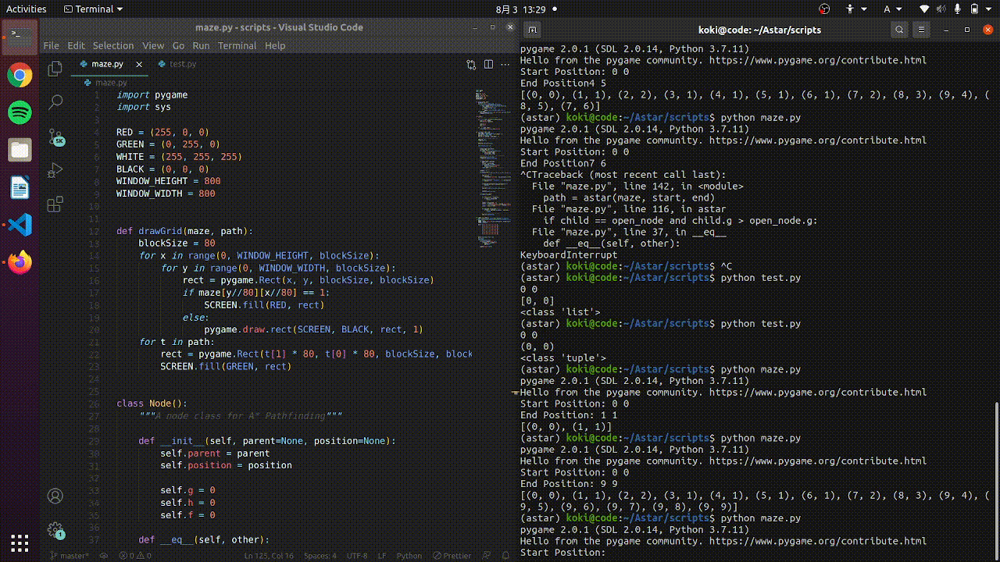

# A* pathfinding with Pygame

>## Table of contents
<p align="center">
<a href="#installation" style="font-size: 50px>Installation</a>
<a href="#usage" style="font-size: 50px>Usage</a>
<a href="#inspired-by" style="font-size: 50px>Inspired by</a>
</p>

***



***
<a name="install"></a>
>## Installation

First, you need to install Pygame
```
pip3 install pygame
```
And then, download my github repository on your device
```
git clone https://github.com/koki1610168/Astar-Pathfinding-with-Pygame.git
```
<a name="usage"></a>
>## Usage
Run maze.py
```
python maze.py
```
You will see the following texts on your terminal
```
Start Position: 
```
You can type start positioin. By the way this grid is 10x10. 
```
Start Position: 0 0
```
Be careful! Do not include a comma between two numbers.
Do same with end position.

**Congratulation!**

<a name="inspired"></a>
>## Inspired by

[Greate tutorial for A* pathfinding](https://medium.com/@nicholas.w.swift/easy-a-star-pathfinding-7e6689c7f7b2)

